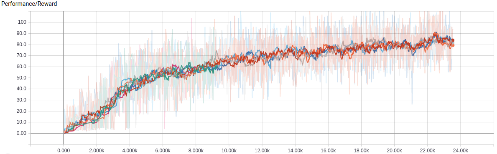

# Implementation of  "Learning to Navigate in Complex Environments"

Tensorflow implementation of [Learning to Navigate in Complex Environments](https://arxiv.org/abs/1611.03673).

Most of the codes are borrowed from [Simple Reinforcement Learning with Tensorflow Part 8: Asynchronus Advantage Actor-Critic (A3C)](https://github.com/awjuliani/DeepRL-Agents/blob/master/A3C-Doom.ipynb) and [Maze Navigation using Reinforcement Learning](https://github.com/tgangwani/GA3C-DeepNavigation).

## Requirement
 - Tensorflow 
 - Deepmind Lab
 - Scipy

## How to build

1. Clone the repo https://github.com/superMDguy/lab, an UNOFFICIAL version of **Deepmind Lab** which support Python 3.
2. Follow the instructions (https://github.com/superMDguy/lab/blob/master/docs/build.md#step-by-step-instructions-for-debian-or-ubuntu-using-python-3-experimental) on the Github. (Recommended using bazel 0.5.2, newer version may fail to build)
3. Clone this repo under `lab/python3/`.
4. Modify `BUILD` under `lab/` folder. Add bazel instructions at the end of file
```
py_binary(
    name = "nav_a3c_train",
    srcs = ["python3/nav_a3c/train.py"],
    data = [":deepmind_lab_py3.so"],
    main = "python3/nav_a3c/train.py",
    default_python_version = "PY3",
    srcs_version = "PY3",
)
```
5. Train the model
```
$ bazel run :nav_a3c_train --define headless=glx
```
If you want to show the game during training
```
$ bazel run :nav_a3c_train --define headless=false
```

## Result 

